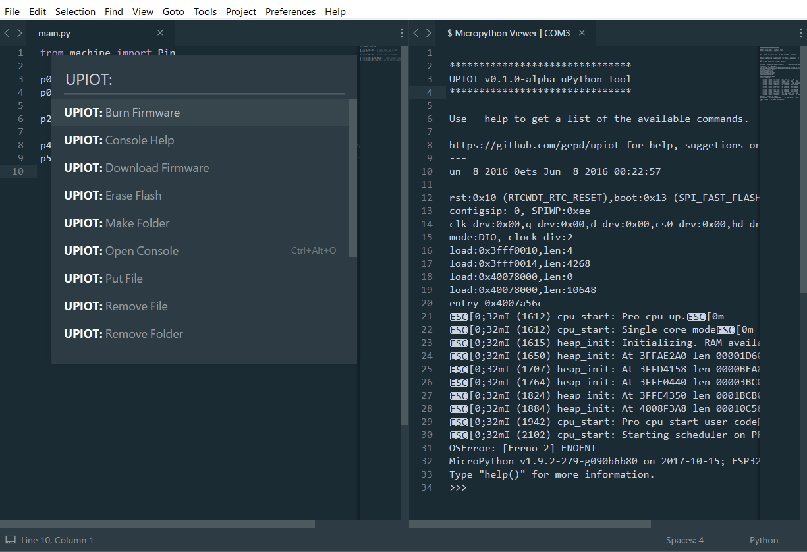
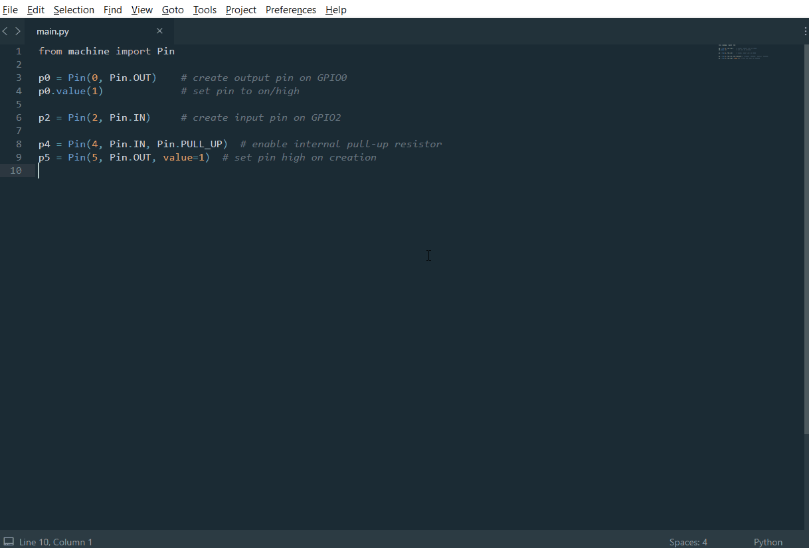
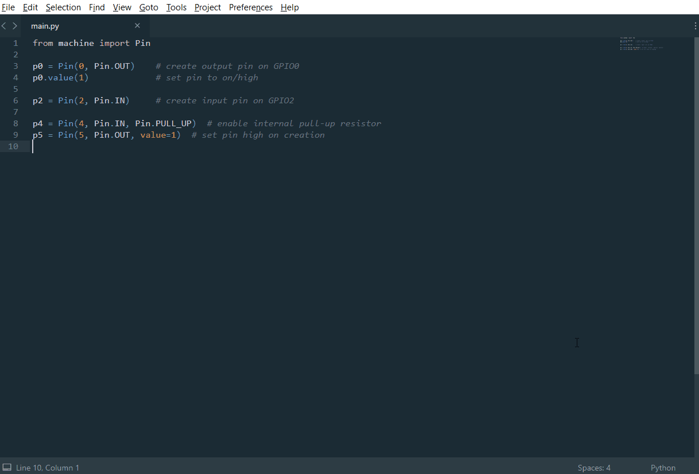
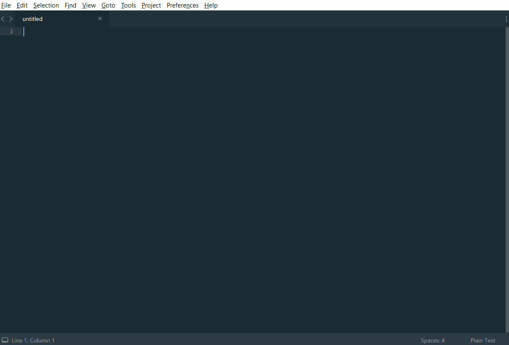
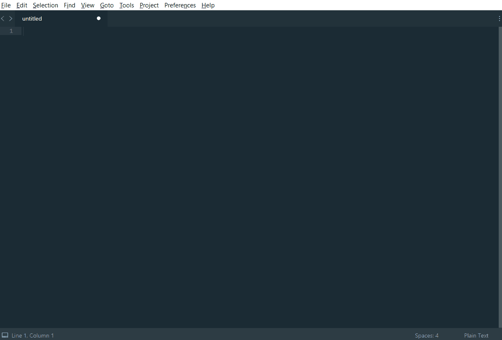
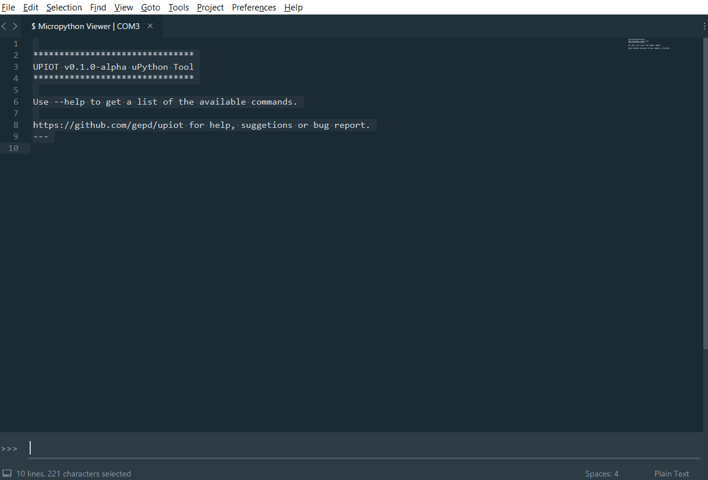

    
    
    
    

# uPiot - MicroPython Tool

    
    
Sublime theme used: <a href="https://github.com/ihodev/sublime-boxy">Boxy</a>

---

> **uPiot** is an experiment to make the work with uPython (micropython) a little bit easier. It uses an modified version of [ampy](https://github.com/adafruit/ampy/) called `sampy` (Sublime + ampy) to comunicate with the device and [pyserial](https://github.com/pyserial/pyserial) to listen for changes. You can also burn the firmware direct from Sublime Text without any extra tool.
>
> It is in an alpha state, so you may find some bugs hanging around.

# Setup

uPiot is not yet in the Package control, so you may need an extra step to install it.

1. Go to `Preferences > Package Package Control > Add Repository` 

* Paste https://rawgit.com/gepd/uPiot-MicroPython-Tool/master/repository.json

2. Press `ctrl+shift+p` or go to `ST Menu > Preferences > Package Control` and select the option `Package Control: Install Package`

3. Search for `upiot` and install it.

# Getting Started

Use the shortcut `ctrl+alt+m` to see all available uPiot options in the command menu.

**Burn the firmware**

1. From the command menu select `UPIOT: Download Firmware`

2. Go to http://micropython.org/download and copy the link of the `esp8266` or `esp32` firmware (I've tried the plugin only in this boards) and paste it in the input panel in Sublime Text. 

* It will start to download the file (you will see the download progress in the status bar)

3. After the download is finished opens the command menu again and select `UPIOT: Burn Firmware`. 

* Selects the serial port if it ask for one, the board used and the firmware previously downloaded. 

* You'll see the message `Do you want to erase the flash memory?`, if it's your first time burning micropython, select yes.

When it is finished, you will be ready to use micropython in your device.

---

**Using micropython**

To use micropython opens the console with the option `UPIOT: Open Console` (from the command menu). In the input panel paste `print("Hello world from uPiot")`. If everything is fine you will see `Hello world from uPiot`

> Micropython try to run `main.py` each time your board is powered on (or reseted), when you don't have this file you will see `OSError: [Errno 2] ENOENT: main.py` in the output. 

Make a new file and save it as `main.py`, writes `print("Hello world from uPiot")` on it and send it to your device with the command `UPIOT: Put Current File` (You can use `UPIOT: Run Current File` in case you want to test it first) after it finished, restart your board; the error won't be there and you should see the `Hello world from uPiot` in the output.

# Commands

That are the current list of commands availables in the console.

Usage: `sampy COMMAND [ARGS]`

| Command | Description |
----------|-------------|
|**ls**|List the contens on the board|
|**run** file_name|Run a script and print it's output|
|**get** file_name|Retrieve a file from the board|
|**put** file_name|Put a file or folder and its contents on the board|
|**rm** file_name|Remove a file from the board|
|**mkdir** folder_name|Create a directory on the board|
|**rmdir** folder_name|Forcefully remove a folder and all its content from board|
|**reset**|Perform soft reset/reboot of the board|
|**--help**|Shows this information|

> Note that if you don't write prefix 'sampy' in the console the string will be sent as a raw text to the device (with the `\r\n` ending)

List of options available in the command menu. (`ctrl+alt+m`)

|Option|Description|
|------|-----------|
|Burn Firmware|Burn a micropython firmware in the selected device. [Read More](#burn-the-firmware)|
|Download Firmware|Download a firmware from http://micropython.org/download and store it in your machine. This file will be used with the `Burn Firmware` option|
|List Files in Device|Shows all file in the device|
|Erase Flash|Erase the memory flash of your device. You will be promt to erase the memory flash of your device before burn the firmware|
|Make Folder|Make a folder in the selected device (you can choose the device from `Select Serial Port`)|
|Open Console|Opens the console to interact with the device, before open it selec the device in`Select Serial Port`|
|Put File|Puts the given file in the device. You need to give it the absolute path to this option work|
|Remove File|Removes the given file in the device|
|Remove Folder|Removes a folder from the device|
|Put Current File|Puts the focused file your device|
|Run Current File|Runs the focused file your device|
|Select Serial Port|Selects the serial port to be used in the Console or `Burn Firmware` command|
|Write in Console|Sends an string through the serial port. You can also use the [Console commands]|
|Sync File From Device|Search all files in your device and save it in the given location|
|Help|Opens this github|

## Shortcuts

At this moment, there is 4 importantant shorcuts:

* `ctrl+alt+m` Opens the command menu to see all options availables in uPiot
* `ctrl+alt+o` Opents the uPiot console
* `ctrl+alt+r` Runs the current file
* `ctrl+alt+p` Puts the current file

I haven't test the shortcuts in all platforms, if you have any problem [open a issue](https://github.com/gepd/uPiot-MicroPython-Tool/issues)

## Donate

Support the open source!. If you liked this plugin, and you want to make a contribution to continue its development, do it through [this link](https://gratipay.com/~gepd/). If you have any problems, or want to contact me: <gepd@outlook.com>

## License

Copyright 2017 GEPD <gepd@outlook.com>

uPiot is licensed under MIT license. [Read](https://github.com/gepd/upiot/blob/master/LICENCE) the full License file.

> Note that may be some dependencies under a different license
